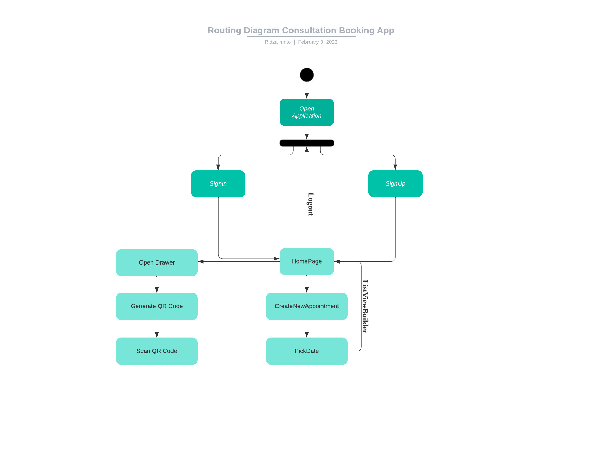

*Ridza Kalimanto 1810595*

# Consultation Appointment Flutter App

## Introduction

This app is an appointment booking app that is created with the aim to make appointment with teacher very easy. Student will be able to make an appeal for consultation, and teacher will be able to approve or reject the appointment.

## Objective

This project aims to make it simple to create appointment with teacher. 

These days, the most common way to make an appointment with our teacher is to either make a reservation after the class ended or contact him/her through social media/email.

Unfortunately, these two approach have their own limitations and hassle.

For the first approach, the students will most likely forget to make a reservation as they are tired after having a class.

As for the second approach, more often than not, students appeal will be buried deep within other chats/emails on the teacher's phone.

Thus, by creating an app which sole purpose is for consultation reservation, both students and teachers can manage their consulation from the comfort of their own smartphone.

## Features and functionalities

-[x] User Authentication using Firebase
-[x] Different roles routing
-[x] Logout function
-[x] Create new appointment
-[x] Delete appointment
-[x] Approve or reject appointment

## References

Below are some of the references that I used throughout the making of this application

- [Flutter Documentation](https://docs.flutter.dev/)
- [Mitch Koko Youtube Channel](https://www.youtube.com/@createdbykoko)
- [Flutter Mapp Youtube Channel](https://www.youtube.com/@FlutterMapp)
- [Hey Flutter Youtube Channel](https://www.youtube.com/@HeyFlutter)
- [Stack Overflow - Already lost track which pages I went through](https://stackoverflow.com/)
- [Google - to represent other forums that I went in and checked](https://www.google.com)

## Routing Diagram

